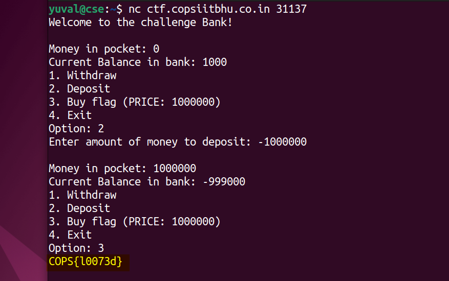

# Bank (100) - pwn

Total solves - 109

Final score - 20

## Description
Can you steal money from the bank and buy the flag?

`nc ctf.copsiitbhu.co.in 31137`

Author - kn1gh7

## Atachments
chall.c

## Box and Port
ctf.copsiitbhu.co.in:31137

## Writeup
> Lines 35-39

```C
scanf("%d", &input);
if(input <= money) { // No check for negative input here
    balance += input;
    money -= input;
}
```
As negative numbers can be added, any negative input will increase money (money -= (-1000000) ==> money += 1000000)



## FLAG
COPS{l0073d}
