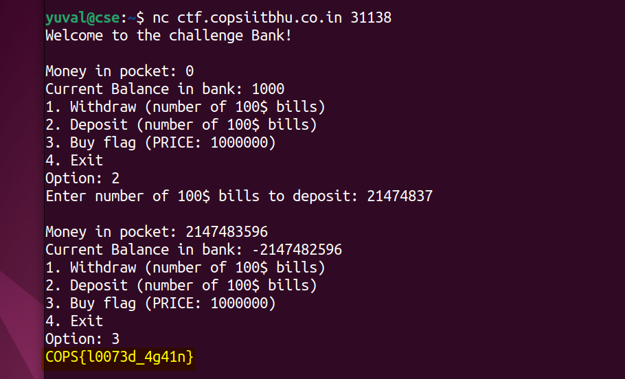

# Bank 2 (200) - pwn

Total solves - 53

Final score - 40

## Description
Can you steal money from the bank and buy the flag?

`nc ctf.copsiitbhu.co.in 31138`

Author - kn1gh7

## Atachments
chall.c

## Box and Port
ctf.copsiitbhu.co.in:31138

## Writeup
This is a simple integer overflow challenge, inspired from picoCTF 2019 challenge 'Flag Shop'

> Lines 40-49

```C
scanf("%d", &input);
if(input < 0) { // Negative input checked here
    printf("Hehe this was patched!");
    continue;
}
input = input * 100;
if(input <= money) { // But not here
    balance += input;
    money -= input;
}
```
What should have come to mind - Is it possible for a positive number to become negative after multiplying it by 100?

The answer is Yes! As the type of input is `signed int`, its max positive value is limited to $`2^{32} - 1 = 2147483647`$. This means that any value larger than this if in a signed int would become negative (Read about 2's complement signing [here](https://en.wikipedia.org/wiki/Two%27s_complement)).

Now payload requires an input such that 100 times that input turns negative so money can be gained on depositing. As integer overflow starts at 2147483648, one possible payload is 21474837



## FLAG
COPS{l0073d_4g41n}
