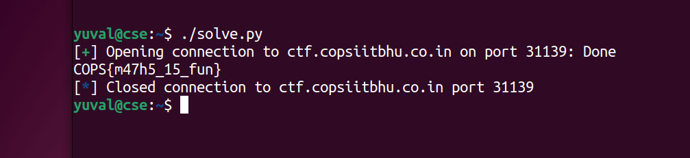

# math game (easy) (300) - pwn

Total solves - 49

Final score - 79

## Description
Answer me 100 times and you get the flag. Easy right?

`nc ctf.copsiitbhu.co.in 31139`

Author - kn1gh7

## Atachments
math_game.py

## Box and Port
ctf.copsiitbhu.co.in:31139

## Writeup
The challenge intended to introduce participants with pwntools scripting (also can be done manually)

pwntools is a python library used extensively in CTFs due to its rich feature set and ease of use

Solve script for this chall would be framed as follows:

```python
#! /bin/python3
from pwn import *
import warnings
warnings.filterwarnings('ignore')

target = remote("ctf.copsiitbhu.co.in", 31139) # connect to remote network
# target = process("./math_game.py") --> for testing on local machine 
score = 0 # initialise a variable for score

while score < 100:
    # form a logic to get the correct line of input
    target.recvuntil('(')
    s = "(" + target.recvline().decode('utf-8')
    target.recvuntil(':')
    # evaluate the ans
    ans = eval(s)
    # send the ans
    target.sendline(str(ans))
    # increment the score
    score += 1

target.recvuntil("FLAG: ")
print(target.recvline().decode('utf-8'), end=""); # print the flag
```


## FLAG
COPS{m47h5_15_fun}
