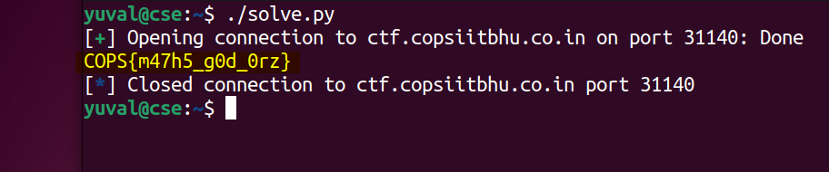

# math game (hard) (500) - pwn

Total solves - 23

Final score - 423

## Description
Answer me 10000 times and you get the flag. But there is a catch:

1. Answer each question within 1 second
2. Find both answer and question yourself :D

Can you get it?

`nc ctf.copsiitbhu.co.in 31140`

Author - kn1gh7

## Atachments
math_game.py

## Box and Port
ctf.copsiitbhu.co.in:31140

## Writeup
The challenge intended to introduce participants with pwntools scripting (cannot be done manually) and introduce them to the concept of random generation.

pwntools is a python library used extensively in CTFs due to its rich feature set and ease of use

Once seen the difference from `math game (easy)`, you should notice the `random.seed()` method used and search about it. Basically, with the seed set, the sequence of random numbers generated would be same. Thus you already know the input!

Solve script for this chall would be framed as follows:

```python
#! /bin/python3
from pwn import *
import random
import warnings
warnings.filterwarnings('ignore')

target = remote("ctf.copsiitbhu.co.in", 31140) # connect to remote network
# target = process("./math_game.py") --> for testing on local machine
score = 0 # initialise a variable for score
# mimic the functioning of the python file on server
random.seed(69696969)
operators = ["+", "-", "*"]
while score < 10000:
    target.recvuntil(':')
    a = random.randint(-1000, 1000)
    b = random.randint(-1000, 1000)
    c = random.randint(0,2)
    s = f"({a}) {operators[c]} ({b})"
    ans = eval(s)
    # send ans
    target.sendline(str(ans))
    # increment score
    score += 1

target.recvuntil("FLAG: ")
print(target.recvline().decode('utf-8'), end=""); # print flag
```

Personally, I feel that math game (hard) is actually easier as once you know the input you already have the list of answers generated and you can simply pipe that list into the nc server.



## FLAG
COPS{m47h5_g0d_0rz}
