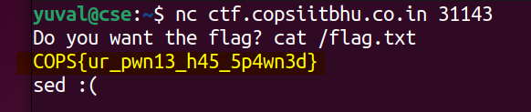

# very easy pwnie (100) - pwn

Total solves - 53

Final score - 20

## Description
Can you print the flag?

Flag is at `/flag.txt` on the nc server

`nc ctf.copsiitbhu.co.in 31143`

Author - kn1gh7

## Atachments
very_easy_pwnie.py

## Box and Port
ctf.copsiitbhu.co.in:31143

## Writeup
The challenge is intended to teach the risks associated with improper use of eval

> Line 5

```python
ans = eval(os.system(input("Do you want the flag? "))) # input here would run the command on server
```
The challenge boils down to running a command to print the content of the flag.txt file which can be easily done with `cat /flag.txt`



## FLAG
COPS{ur_pwn13_h45_5p4wn3d}
