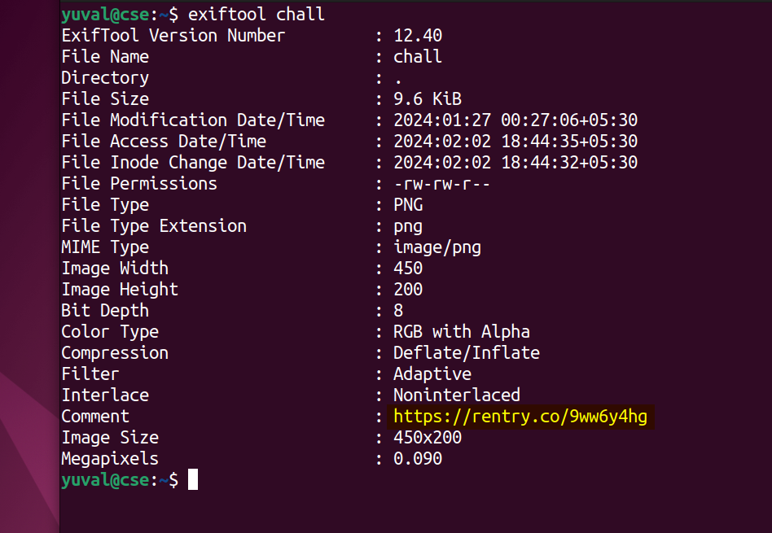
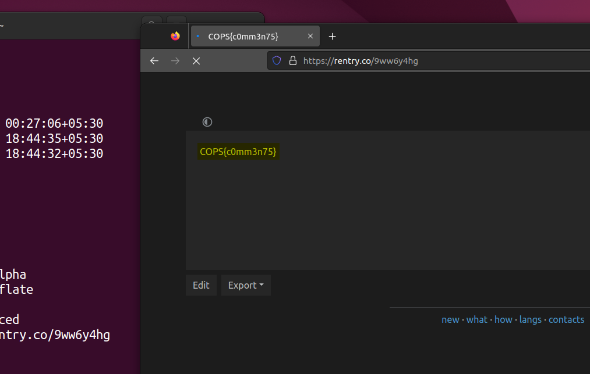

# Extremely Xeroxed Image File (100) - stego

Total solves - 91

Final points - 20

## Description
Just find the flag!

Author - kn1gh7

## Attachment
chall

## Writeup
The title **E**xtremely **X**eroxed **I**mage **F**ile points towards EXIF meaning metadata. You can simply use exiftool to find a link in comments which contains the flag

## FLAG
COPS{c0mm3n75}
