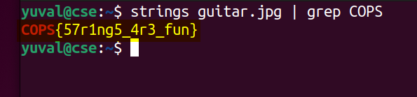

# guitar (100) - stego

Total solves - 127

Final points - 20

## Description
Who doesn't like string instruments right?

Author - kn1gh7

## Attachment
guitar.jpg

## Writeup
The focus on word `string` points towards using **strings**. On running `strings guitar.jpg | grep COPS`, you get the flag

## FLAG
COPS{57r1ng5_4r3_fun}
