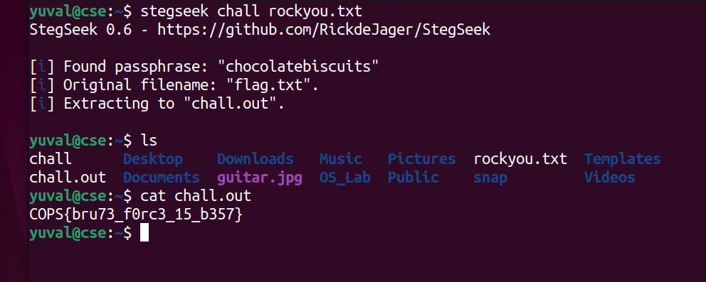

# hide and seek (300) - stego

Total solves - 2

Final points - 300

## Description
Well Hide and Seek used to be a fun game. But am I really referring to that? Maybe the image is also lying...

Author - kn1gh7

## Attachment
chall

## Writeup
**hide** and **seek** refers to tools [steghide](https://github.com/StefanoDeVuono/steghide) (for hiding with password) and [stegseek](https://github.com/RickdeJager/stegseek) (for bruteforcing that password)

Dictionary generally used for it is `rockyou.txt`. You can download it from [here]('https://github.com/brannondorsey/naive-hashcat/releases/download/data/rockyou.txt')

## FLAG
COPS{bru73_f0rc3_15_b357}

